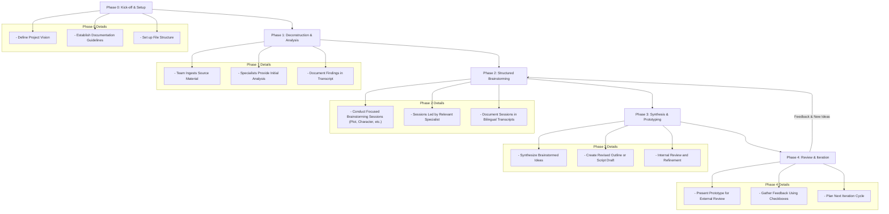

# Evernight Mountain - Project User Guide

This document outlines the systematic workflow for the "Evernight Mountain" project, demonstrating how to effectively use the BMAD Creative Writing expansion pack.

## The Creative Workflow

Here is a visual representation of our phased approach to creative development:

### **Workflow Summary:**

1.  **Phase 0: Kick-off & Setup:** We begin by defining the project's core vision and setting up the necessary documentation and file structures.
2.  **Phase 1: Deconstruction & Analysis:** The full creative team reviews the source material and provides their initial expert analysis, which is formally documented.
3.  **Phase 2: Structured Brainstorming:** We conduct focused brainstorming sessions on specific creative elements. Each session is led by the most relevant specialist and is meticulously documented.
4.  **Phase 3: Synthesis & Prototyping:** The ideas generated during brainstorming are synthesized into a new, tangible creative work, such as a revised script.
5.  **Phase 4: Review & Iteration:** The new prototype is presented for review. Feedback is collected, and the team plans the next cycle of development, often returning to Phase 2 to refine more elements.

---