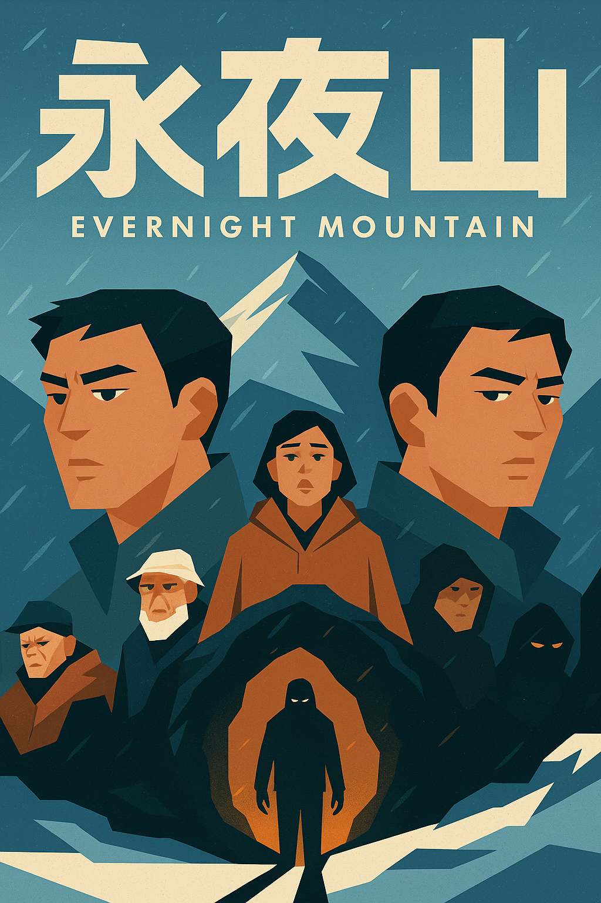

# Evernight Mountain / 永夜山 - Production Bible

**A Psychological Thriller by the BMad Creative Writing Team**

---

## 1. Project Synopsis / 項目簡介

### Logline / 故事大綱
> This is a story about a group of hikers who, trapped on a remote mountain, unearth a dark secret that forces them to confront their inner demons in a deadly game of survival where the line between reality and nightmare blurs.
>
> 這是一個關於一群登山客被困在偏遠的山區，他們揭開了一個黑暗的秘密，迫使他們在現實與夢魘界線模糊的致命生存遊戲中面對自己內心的惡魔的故事。

### Synopsis / 故事梗概
> Seven climbers, including twin brothers with a troubled past, venture into the remote "Evernight Mountain." A sudden snowstorm traps them in a cave, where they find a diary from a doomed expedition in 1969. As they start to experience strange and terrifying events, they realize they are not alone. A dark presence in the cave forces them to reveal their darkest secrets, leading to paranoia, betrayal, and murder. The surviving twin must confront the truth about his past and his brother to have any hope of escaping the mountain alive.
>
> 七名登山客，包括一對有著複雜過去的雙胞胎兄弟，冒險進入偏遠的「永夜山」。一場突如其來的暴風雪將他們困在一個山洞裡，在那裡他們發現了一本來自1969年一支注定失敗的探險隊的日記。當他們開始經歷奇怪而可怕的事件時，他們意識到自己並不孤單。山洞中的一個黑暗存在迫使他們揭露自己最黑暗的秘密，導致偏執、背叛和謀殺。倖存下來的雙胞胎必須面對關於他過去和他兄弟的真相，才能有希望活著逃離這座山。

---

## 2. Director's Vision / 導演闡述

> "This film is a psychological thriller wrapped in a supernatural horror. The visual tone will be claustrophobic and desaturated, with the mountain itself acting as a character. The pacing will be a slow burn, building to a relentless and terrifying climax. The key is to keep the audience guessing: is it a ghost, a curse, or the darkness within their own hearts? The answer is all of the above." - **Donnie, The Director**
>
> 「這部電影是一部包裹在超自然恐怖之中的心理驚悚片。視覺基調將是幽閉和去飽和的，山本身就是一個角色。節奏將是緩慢燃燒的，最終達到一個無情而可怕的高潮。關鍵是讓觀眾一直猜測：是鬼，是詛咒，還是他們自己內心的黑暗？答案是以上皆是。」 - **唐尼，導演**

---

## 3. The Creative Team / 創意團隊

*   **Orchestrator:** BMad Orchestrator
*   **Producer:** Marcus
*   **Director:** Donnie
*   **Plot Architect**
*   **Character Psychologist**
*   **Dialogue Specialist**
*   **World Builder**
*   **Narrative Designer**
*   **Genre Specialist**
*   **Editor**

---

## 4. Production Progress / 製作進度

*   **Current Phase:** Pre-production / Script Development
*   **Status:** Completed character development session; refined 3 core character arcs with production-friendly adjustments.
*   **Next Steps:** Script revisions by week's end, then prepare for casting alignment meeting (2025-08-28).

---

## 5. Session Records / 會議記錄

*This section contains links to the transcripts of our creative sessions.*

*   [Phase 1: Complete Analysis / 第一階段：完整分析](Docs/phase_1_complete_analysis_bilingual.md)
*   [Phase 2: Plot & Structure Session / 第二階段：情節與結構會議](Docs/plot_and_structure_session_bilingual.md)
*   [Phase 3: Character Development Session / 第三階段：角色發展會議](Docs/character_development_session_bilingual.md)

---